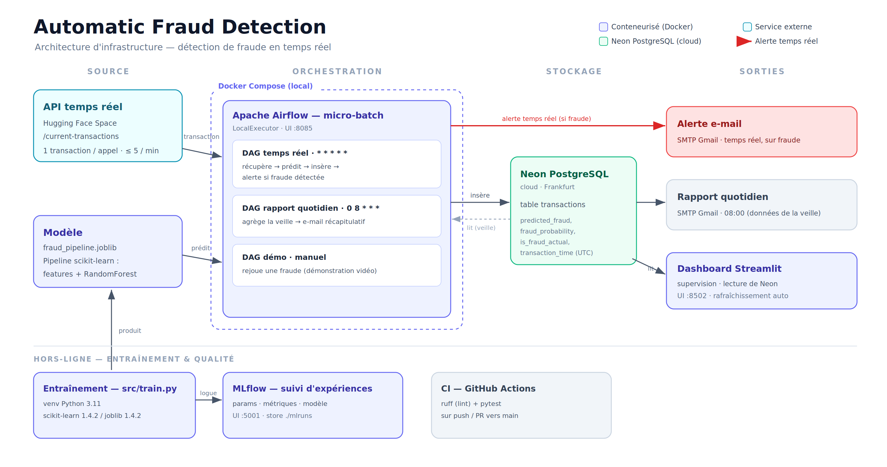

# Automatic Fraud Detection

Pipeline de détection de fraude en temps réel. Un modèle scikit-learn entraîné
hors-ligne est servi par un pipeline de données orchestré par Airflow : chaque
minute, une transaction est récupérée depuis une API, scorée, puis écrite dans une
base PostgreSQL (Neon). Toute fraude prédite déclenche une alerte e-mail, et un
récapitulatif de la veille est envoyé chaque matin. Un dashboard Streamlit donne une
vue de supervision, MLflow trace les entraînements, et une CI lint et teste le code.

## Architecture

Trois couches : source de données, orchestration Airflow, sorties métier.



- **Source** : API HuggingFace Space, une transaction par appel, limitée à
  5 appels/minute.
- **Orchestration** : Airflow (Docker Compose), base de métadonnées PostgreSQL
  distincte de Neon.
- **Stockage applicatif** : Neon PostgreSQL, accédé par les DAGs via `psycopg2`.
- **Sorties** : alerte e-mail (SMTP), rapport quotidien e-mail, dashboard Streamlit.
- **Suivi** : MLflow en mode fichier local (`mlruns/`), sans serveur.
- **CI** : GitHub Actions, lint (ruff) et tests (pytest) des modules purs.

## Choix techniques

- **Un seul `Pipeline` scikit-learn (features + modèle).** Le feature engineering
  est intégré au pipeline sérialisé via un `FunctionTransformer`, et la même fonction
  `construire_features` sert à l'entraînement (CSV) et au serving (API). Le `.joblib`
  part des colonnes brutes et va jusqu'à la prédiction : aucune transformation n'est
  réécrite côté production, ce qui élimine le train/serve skew. Seules des variables
  calculables depuis une transaction isolée sont utilisées (montant, catégorie,
  variables temporelles, âge, distance Haversine) ; aucune feature comportementale par
  client, qui serait toujours vide au serving.

- **Micro-batch via Airflow plutôt que Kafka.** La source ne se rafraîchit qu'à la
  minute et est limitée à 5 appels/minute. Un DAG déclenché chaque minute épouse
  exactement cette cadence ; un système de streaming serait surdimensionné.

- **Seuil de décision à 0.30.** Une notification ne coûte qu'un e-mail, on privilégie
  donc le rappel. À 0.30, le modèle détecte davantage de fraudes qu'à 0.40 au prix de
  quelques faux positifs supplémentaires. Le seuil est configurable via
  `FRAUD_THRESHOLD` ; les deux seuils sont évalués à l'entraînement.

## Prérequis

- Docker et Docker Compose.
- Python 3.11 pour l'entraînement local.
- Une base Neon PostgreSQL et un compte SMTP (mot de passe d'application).
- Le fichier `fraudTest.csv` en local (voir `data/README.md`).

## Mise en route

1. Copier `.env.template` vers `.env` et renseigner les variables (voir plus bas).
   Le fichier `.env` n'est jamais versionné.

2. Entraîner le modèle dans un environnement Python 3.11 :

   ```
   python3.11 -m venv .venv
   source .venv/bin/activate
   pip install -r requirements.txt
   python -m src.train
   ```

   Produit `models/fraud_pipeline.joblib`, affiche les métriques et trace le run
   dans `mlruns/`.

3. Initialiser la table applicative dans Neon :

   ```
   python -m src.db
   ```

4. Démarrer l'orchestration et les interfaces :

   ```
   docker compose up -d
   ```

Services exposés :

| Service | URL |
|---|---|
| Airflow | http://localhost:8085 (admin / admin) |
| Dashboard Streamlit | http://localhost:8502 |
| MLflow | http://localhost:5001 |

Les deux DAGs sont en pause au démarrage. Dépauser `realtime_fraud_detection` pour
lancer le scoring à la minute.

## Démonstration

Pour alimenter le rapport quotidien sans attendre, un script insère un échantillon
du CSV (passé par le vrai pipeline) daté de la veille :

```
python -m scripts.seed_demo
```

Le rapport se déclenche ensuite via `daily_fraud_report`. Pour l'alerte e-mail, le
DAG `demo_alerte_fraude` (déclenchement manuel) sélectionne une fraude du CSV que le
modèle détecte et la fait passer dans tout le pipeline jusqu'à l'envoi.

## Structure

```
.
├── src/                code applicatif (features, entraînement, API, base, modèle,
│                       e-mails, reporting)
├── dags/               DAGs Airflow (temps réel, rapport quotidien, démo)
├── dashboard/          dashboard de supervision Streamlit
├── scripts/            outillage (seed de démonstration)
├── tests/              tests unitaires des modules purs
├── notebooks/          EDA et feature engineering
├── models/             modèle sérialisé (généré)
├── data/               CSV d'entraînement (local)
├── docker-compose.yml  Airflow, dashboard, MLflow
└── .github/workflows/  CI (ruff + pytest)
```

Artefacts régénérables et non versionnés (`.gitignore`) : le CSV (`data/*.csv`), le
modèle (`models/*.joblib`), les runs MLflow (`mlruns/`) et le fichier `.env`.

## Variables d'environnement

Définies dans `.env` à partir de `.env.template` :

- `API_URL` — endpoint de l'API temps réel.
- `CSV_PATH` — chemin local du CSV d'entraînement.
- `DATABASE_URL` — connexion Neon PostgreSQL.
- `FRAUD_THRESHOLD` — seuil de décision (0.30).
- `SMTP_HOST`, `SMTP_PORT`, `SMTP_USER`, `SMTP_PASSWORD`, `ALERT_EMAIL_TO` — e-mail.
- `AIRFLOW__CORE__FERNET_KEY`, `AIRFLOW__WEBSERVER__SECRET_KEY` — secrets Airflow.

## Tests et lint

```
pip install -r requirements-dev.txt
ruff check .
pytest
```

Les tests couvrent les modules sans dépendance externe (`src/features.py`,
`src/reporting.py`). Le serving, les DAGs et l'accès à Neon ne sont pas testés en CI.
